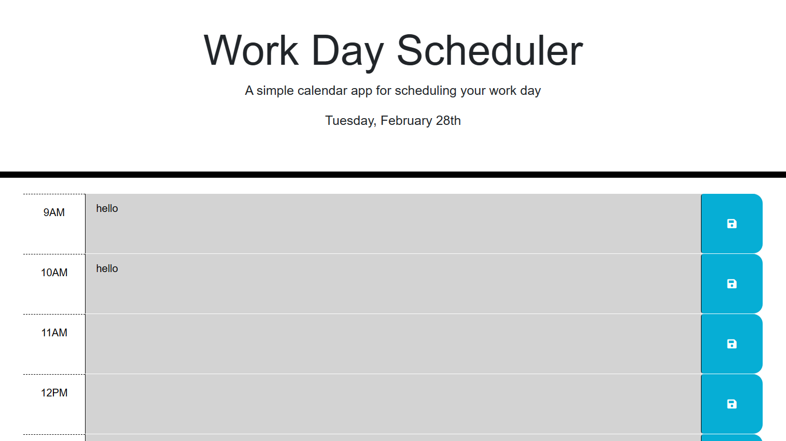

# Work Day Scheduler

## Description

This application uses third-party API and JavaScript to create a calendar-style scheduler allowing users to save events for each hour of the day. This app will run in the browser and feature dynamically updated HTML and CSS by using jQuery. My motivation for working on it is to learn the features of JQuery and other third-party APIs.

## Installation

This app does not require any installation

## Usage
This application allows users to choose a time slot to enter a task. These tasks are stored in local storage so they are still accessible even when the application is refreshed. Current date is displayed on the top of the application and the times are color coded to let the user know when an event has passed, current, or in the future.

View the Site at https://thossain30.github.io/DayScheduler/

## License
This project is licensed under MIT - see the [License](LICENSE) for more information.
